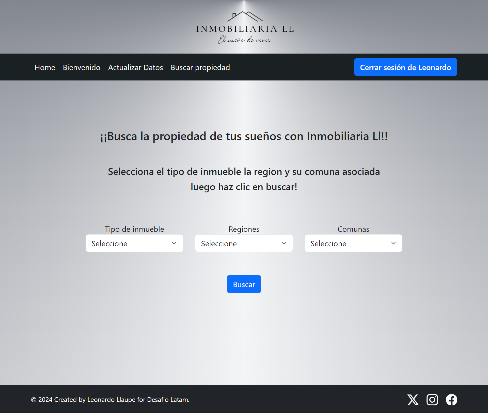
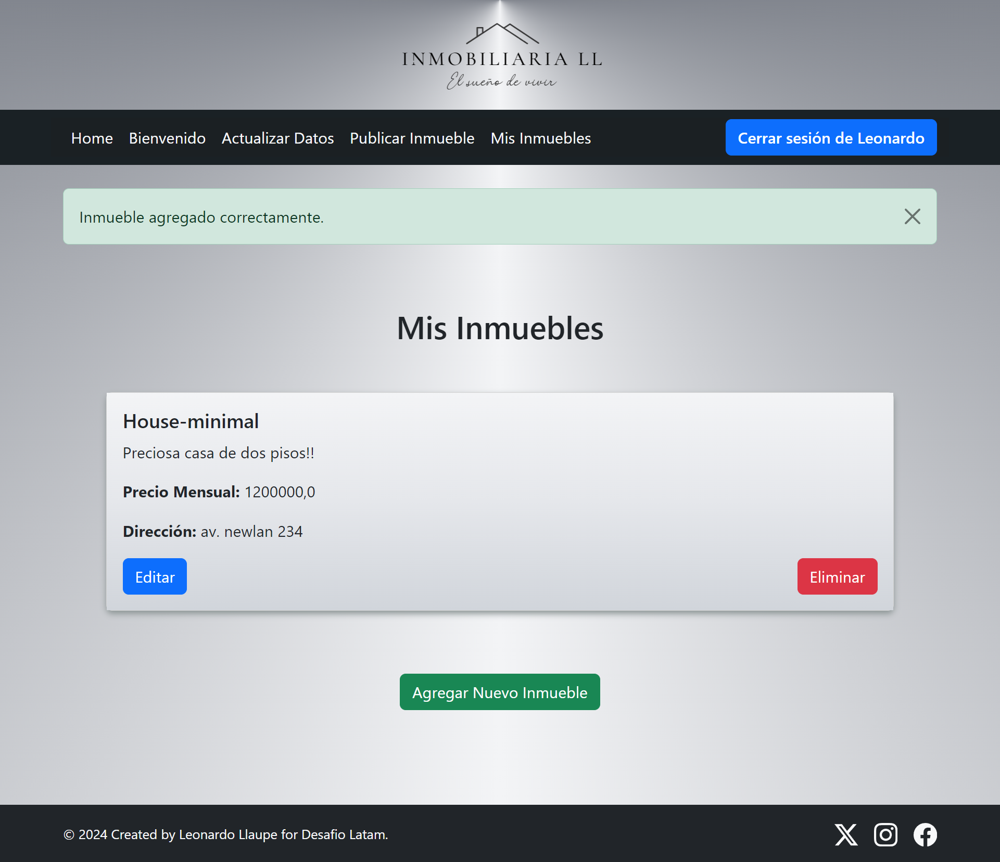

# "Inmobiliaria Ll"  

  
Aplicacion web de busqueda, publicacion y arriendo de inmuebles  

  

# ******** Algunas sugerencias de instalación ********

# Requirements
Para instalar todos los paquetes listados en ev_inmobiliaria.txt usar:  
pip install -r ev_inmobiliaria.txt               

# Base de datos
setting.py ya configurado para usar bbdd postgres; Verificar coincidencia del "NAME" y "PASSWORD" con la bbdd postgres a utilizar

# Loaddata
Para poblar los modelos pais, region y comuna usando loaddata y el json disponible usar:  
python manage.py loaddata json/regiones_comunas_chile.json  

# Scritps de consulta de inmuebles
Los script de consulta de inmuebles por region y comuna son opcionales y van a depender si se hayan poblado dichos modelos, usar:  
python consulta_inmuebles_por_comuna.py  
python consulta_inmuebles_por_region.py  
  
# Algunos Screenshots  

  

Indice  
  
Registro  
  
Buscar inmuebles  
  
Inmuebles disponibles  
 
Publicar un inmueble  
  
Mis inmuebles  
  

  

