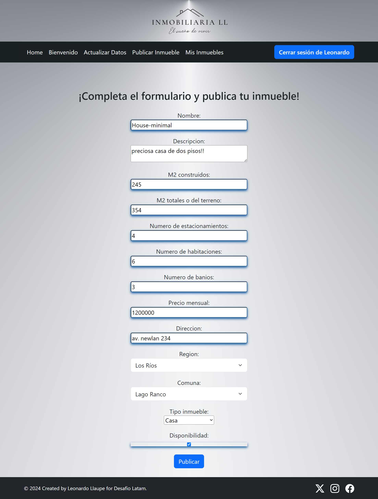

# 
 "INMOBILIARIA LL" 

 APLICACION WEB DE BUSQUEDA, PUBLICACION Y ARRIENDO DE INMUEBLES   
      

  

# ******** Algunas sugerencias de instalación ********

# Requirements
Para instalar todos los paquetes listados en ev_inmobiliaria.txt usar:  
pip install -r ev_inmobiliaria.txt               

# Base de datos
setting.py ya configurado para usar bbdd postgres; Verificar coincidencia del "NAME" y "PASSWORD" con la bbdd postgres a utilizar

# Loaddata
Para poblar los modelos pais, region y comuna usando loaddata y el json disponible usar:  
python manage.py loaddata json/regiones_comunas_chile.json  

# Scritps de consulta de inmuebles
Los script de consulta de inmuebles por region y comuna son opcionales y van a depender si se hayan poblado dichos modelos, usar:  
python consulta_inmuebles_por_comuna.py  
python consulta_inmuebles_por_region.py  
  
# Algunos Screenshots  

  

Indice  
        
Registro  
        
Buscar inmuebles  
        
Inmuebles disponibles  
       
Publicar un inmueble  
        
Mis inmuebles  
  

  

